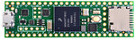
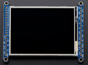
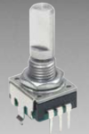
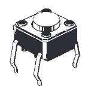
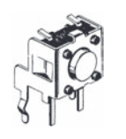
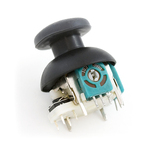
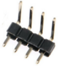
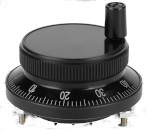
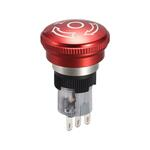
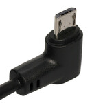

# Bill of Materials

These are the components I have chosen to use for the Manualmatic when using the PCB.

| |Ref	| Qty	|  Value	|  Datasheet |  Manufacturer |
| ---| --- | --- | ----------------------- | ---------- | ----------- | ---- |
|  | U1 |	1	| Teensy4.1| https://www.pjrc.com/store/teensy41.html | Teensy |
| | J1 |	1	| Adafruit-1770-2.8-TFT-Touch	 |	https://www.adafruit.com/product/1770	| Adafruit |
|  | S12 S13 | 2	| PEC11R-4115F-S0018	|	https://www.mouser.co.uk/datasheet/2/54/PEC11R-777457.pdf	| Bourns |
| | S1 S2 S3 S4 S5 |	5	| B3F-1025 |	https://www.mouser.co.uk/datasheet/2/307/en-b3f-13826.pdf	| Omron |
| | S6 S7 S8 S9 S10 S11 S14 | 7	| B3F-3105| https://www.mouser.co.uk/datasheet/2/307/en-b3f-13826.pdf |		Omron |
|  | U2 |	1	|COM-09032	| https://www.sparkfun.com/products/9032	| SparkFun Electronics |
| | J2 | 1 | Right angle male header for MPG| | Generic|

Unless you're brave enough to solder both the Teensy and the Adafruit display to the PCB (I'm not and the case *is not* designed for direct soldering), you'll need 48 female headers for the Teensy and 14 female headers for the display.

I bought these as 4 x 12 pins and 2 x 7 pins as this was significantly cheaper than contiguous blocks. You may need to lightly file adjacent edges so they don't bow the board when soldered in.

You'll also need a 60mm Manual Pulse Generator (ebay ones seem to work just fine, unlike the two encoder buttons), a 16mm Estop button and a tight/compact right angle micro-USB cable (2-3m) - preferably in the orientation shown below.

   

J3 (2 pin, soft estop), J3, J4 & J5 (3 & 4 pin spare breakouts) are optional right angle male headers.

**Notes:**

1. I recommend sourcing the two encoder buttons from a known supplier unless you are sure of their provenance - I have had two 'ebay specials' fail which have effectively wasted the PCBs. The specified encoders also have a short shaft to work with the case.
2. The 5 push buttons and 7 right angle buttons are of a specific detent force (orange button) and closely match the detent force of the two encoders and the joystick, maximising the consistency of 'feel'. Ebay ones are of very variable detent strength - often very low.
3. The joystick PCB footprint will only fit the Sparkfun Deluxe COM-09032 joystick. The Xbox replacements have a different footprint (and the ebay ones have 'interesting' resistance characteristics).
4. If you are using the 3D printed case (recomended, it's a work of art ;-)), you'll need 4 x 11mm brass stand-offs and 8 x 8-10mm M3 dome/button head screws.
5. We are using the Adafruit display in SPI mode, so you will need to bridge the pads on the back of the board as per: https://learn.adafruit.com/adafruit-2-8-and-3-2-color-tft-touchscreen-breakout-v2/spi-wiring-and-test#spi-mode-jumpers-906160-5