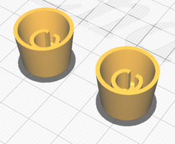

# Manualmatic Pendant Case v1.1

Designed around the v1.1 PCB to be 3D printed. Tolerances are built in but you may need to tune your slicer settings to get an accurate fit.

## Base

Print 'as is' - will require supports for the MPG and display holes. I also used support for the e-stop shroud but this may not be essential.

## Encoder Panel

Flip this over to print. Will require supports for the display holes/lugs and the lip that will end up under the MPG. I also generated support for the modifier button hole.

## Left/Right Side Button Panels

Flip over to print - bed adhesion is critical as these have a tendency to warp with PETG, so print in the centre of the bed and, if possible, with an enclosure.
Support is not necessarily required but I generated it for the button holes.
Ensure the top grooves are clear before assembly (test fit with the display bezel).

## Display Bezel

Flip over to print. Support is required only for the corner hole counterbores. 

## Cable Wedge x2

Mirror one part and print both standing on the (only) flat face. Support is advised for the hole.

These should slide fairly easily into the base (ie, don't spring the gap open or you won't get the MPG studs in). Before putting it all together, make sure your cable fits through the hole with the two faces just about touching - to adjust, fit the parts in the base and ream out with a drill bit or needle file.

## Joystick Dome

Print 'as is'. Does not require support. Push fit into the top of the encoder panel.

## Joystick Button

Print 'as is' - requires support but remove very carefully!

Currently this is an 'inside' button - may redesign as an 'outside' button (ie dome underneath).

## Side Buttons x7

Print as is. These can be taped to the case (inside) before assembly but don't overlap the rebate.

## Row Buttons x5

Print as is - each button is in two parts. The top part can be taped into the display bezel before assembly (there's a little relief for the tape).

## Encoder Knobs x2

Print as is, no support required.

## MPG Spanner

Print 'as is', I do not advise using support. 

Use this to hold & tighten the nuts for the MPG.