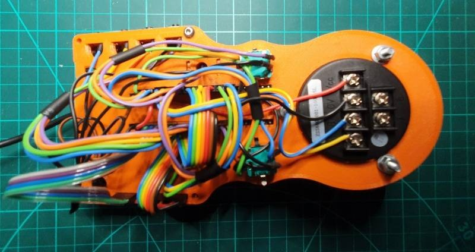

# Manualmatic Pendant Schematic

[This](manulmatic-schematic.pdf) is how I have wired the [Teensy 4.1](https://www.pjrc.com/store/teensy41.html), the [Adafruit 2.8" Touch screen](https://learn.adafruit.com/adafruit-2-8-and-3-2-color-tft-touchscreen-breakout-v2) and the various encoders & buttons for the proof of concept. The code base is written to this schematic.

Where possible I have grouped pins together, so if you have access to a Molex crimper the wiring is not too onerous. I strongly suggest making short 'ribbon cables' to keep the birds nest tidy(ish).

The 'bridge' for the configurable button row holds the Teeensy in place at the centre but probably better to push all the Molexes onto the Teensy pins before attaching the display.

The wiring check has now moved to 'Software': [test_pendant_wiring](https://github.com/Stutchbury/Manualmatic-Pendant/tree/main/Software/PlatformIO/pendant/ManualmaticWiringCheck)  

This is a PlatformIO 'sketch' that will enable you to check everything is wired as expected.

The schematic is [here](manulmatic-schematic.pdf).