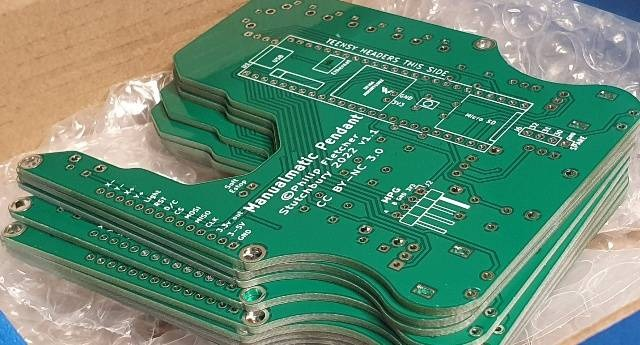

# The Manualmatic Pendant for LinuxCNC (or any other 4D system)


The Manualmatic Pendant enables you to perform the majority of routine LinuxCNC setup, manual and automatic operations without having to step away to a PC monitor.

<!-->
Proof of concept:

-->


Kicked off [here](https://forum.linuxcnc.org/18-computer/44682-arduino-teensy-python-interface-manualmatic-mpg-pendant) on the LinuxCNC forum.

The currently released code implements almost all the functionality for both manual and auto control but don't take my word for it, here's a comment from das_machinist on Discord:


Auto mode screen (uses the [DisplayUtils](https://github.com/Stutchbury/DisplayUtils) library):


Setting offsets (uses the [TouckKeypad](https://github.com/Stutchbury/TouchKeypad) library):


There is now a complete 3D printable case  and a PCB  - contact me for details (email in my bio).


The pendant software has now been migrated to PlatformIO - using [Teensyduino](https://www.pjrc.com/teensy/td_download.html) via the Arduino IDE did end up too knarly.


Communication beween the [Teensy 4.1](https://www.pjrc.com/store/teensy41.html) and the [LinuxCNC Python Interface](https://www.linuxcnc.org/docs/html/config/python-interface.html) is over USB using a very simple protocol.


While the pendant prioritises working with LinuxCNC, in principle it is a fairly agnostic UI to control anything that you'd like to move in 4D that can read from & write to the serial port over USB.


## Getting Started

This was always intended to be "Almost Plug'n'Play"&trade; but does require the PlatformIO to upload to the Teensy and two files copied to your LinuxCNC config directory.

- Clone or download this repository and extract somewhere convenient (not usually on your LinuxCNC machine).

### PlatformIO Install

- Follow the install instructions here: https://platformio.org/platformio-ide

- Required libraries will be automatically downloaded based on the ```platformio.ini``` file.


- There are two folders of interest: 
  - The main codebase for the pendant: ```Software/PlatformIO/pendant/ManualmaticPendant``` or
  - A wiring check 'sketch': ```Software/PlatformIO/pendant/ManualmaticWiringCheck```

Open either of these folders and PlatformIO will allow you to compile and upload.

### LinuxCNC Install

- Copy both ```Manualmatic.py``` (the class def) and ```manualmatic``` (the component, lowercase, no file extension) to your LinuxCNC config directory.
- Add the following line to custom.hal (replace ```gmoccapy.ini``` with your ini file name):    
```loadusr -W ./manualmatic gmoccapy.ini```
- Change the ```manualmatic``` file to executable. e.g. ```chmod +x manualmatic``` 
- Plug your manualmatic pendant into a USB port - make sure appears as ```/dev/ttyACM0```
- Start LinuxCNC, preferably from the command line (to see any errors).

Note: LinuxCNC >= v2.9 now uses python3 with no default to 'python', so the ```manualmatic``` component file and the ```mock_cnc_machine.py``` file have been updated to use python3.


