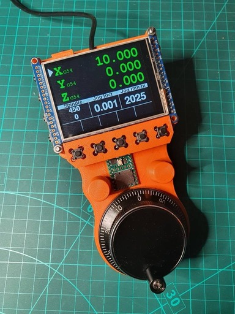

# Arduino/Teensy Manualmatic MPG/Pendant for LinuxCNC


My Christmas project for 2021 - the aim being to be able to perform the majority of routine LinuxCNC setup, manual and automatic functions without having to step away to a PC monitor.

Proof of concept:


Kicked off [here](https://forum.linuxcnc.org/18-computer/44682-arduino-teensy-python-interface-manualmatic-mpg-pendant) on the LinuxCNC forum.

This still a work in progress but has already resulted in me releasing a few Arduino libraries that will hopefully help in other projects too. 

The currently released code implements almost all the functionality for both manual and auto control.

Auto mode screen (uses the [DisplayUtils](https://github.com/Stutchbury/DisplayUtils) library):


I'm currently building all the pendant software using [Teensyduino](https://www.pjrc.com/teensy/td_download.html) via the Arduino IDE - as this has (I think) greater user coverage. That may change to PlatformIO if it gets too knarly.


Setting offsets (uses the [TouckKeypad](https://github.com/Stutchbury/TouchKeypad) library):


The communication beween the [Teensy 4.1](https://www.pjrc.com/store/teensy41.html) and the [LinuxCNC Python Interface](https://www.linuxcnc.org/docs/html/config/python-interface.html) is over USB using a very simple protocol.

Hopefully this will result in an 'Almost Plug & Play' pendant: copy a file (maybe two) to your config directory and then add a single line to ```custom.hal```.

While the pendant prioritises working with LinuxCNC, in principle it is a fairly agnostic UI to control anything that can read & write the serial protocol.


