# Soldering the PCB

A few notes on soldering the components to the PCB - primarily the order of operations that has worked best for me.

The Teensy 4.1 and the Adafruit 2.8" Touchscreen are plugged in to female headers on the PCB - all other components are soldered directly to the board.

### Order of Operations

Ensure all components are fully seated and square to the PCB. The 3D printed case has some tolerance built in but not a lot.


1. **Teensy Male Headers**: Solder the male headers to the back of Teensy 4.1 (ie pins are on the opposite side to the USB and SD card) on both edges.   <br/>   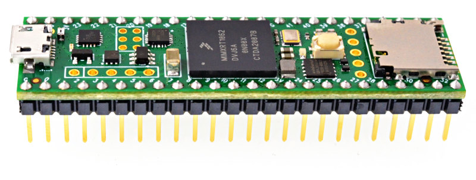
2. **Display Male Header**: Solder ***just 14*** male header pins to the Adafruit display. I recommend temporarily fitting the 11mm brass standoffs to attach the display to the PCB to ensure everything aligns. *Do not solder the female headers to the PCB yet*.  <br/>    **NOTE**: The IM1, IM2 and IM3 SPI Mode Jumpers (on the back of the display) must be closed with solder as per the Adafruit instructions here: https://learn.adafruit.com/adafruit-2-8-and-3-2-color-tft-touchscreen-breakout-v2/spi-wiring-and-test#spi-mode-jumpers-906160-5  (You can see IM1 in the photo below)  <br/>     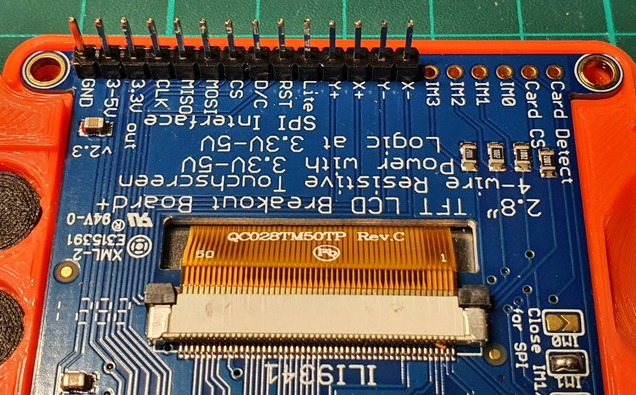
3. **Teensy Female Headers**: Solder the two 24 pin female headers (reference U1) for the Teensy to the back of the PCB. If you are using 4 off 12 pin female headers (a much more economical option) you may need to lightly file adjacent ends to ensure the board is not bowed.   <br/>   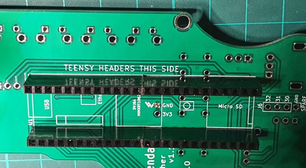 
4. **Row Buttons**: Fit the five 'row buttons' (B3F-1025 in references S1, S2, S3, S4 & S5) to the top of the board and solder from the back.   <br/>   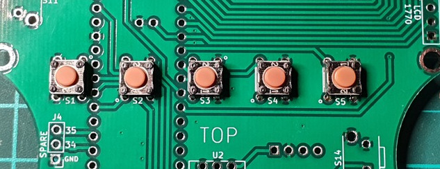 
5. **Edge Buttons**: Fit all seven edge buttons (B3F-3105 in references S6, S7, S8, S9, S10, S11 & S14) and solder from the back. The board will rest on the tops of the buttons helping to ensure they go in square if you press down on the PCB while soldering.   <br/>  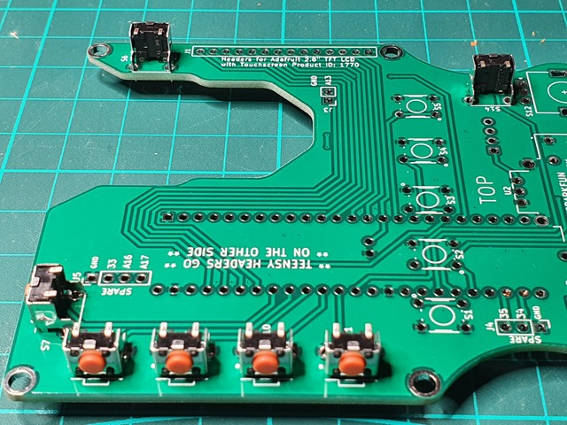
6. **Display Female Header**:  Solder the female header for the display (reference J1) to the front of the board. I recommend temporarily fitting the 11mm brass standoffs to ensure everything aligns. (I probably should've cleaned up the filings that stuck to the tape residue before taking the photo...)  <br/>  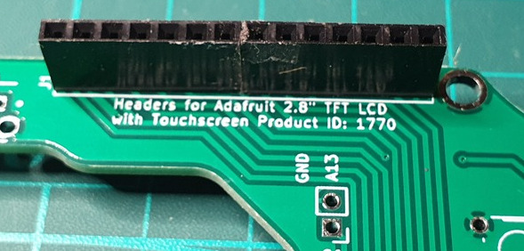
7. **Joystick**: Spend some time cursing as you try to align all the pins on the joystick (COM-09032 in reference U2). It can take a while. Press the button area of the joystick *very* firmly down as you solder those pins first and when soldering the other pins, ensure the rest of the base is tight (or at least parallel) to the PCB or the joystick will not be central when it is at rest.  <br/>   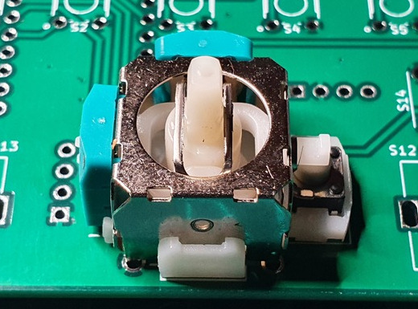
8. **Encoders**: Fit the two encoder buttons (PEC11R-4115F-S0018 in references S12 & S13). They *should* 'click' into place and hold themselves tight to the PCB while being soldered.   <br/>  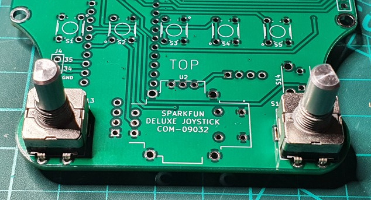
9.  **MPG Header**: Solder the right angle male header for the MPG to the back of the board (reference J2). You can optionally solder the MPG wires directly to the PCB -  I'd recommend hot glue strain relief as there's a fair bit of fiddling when putting the case together.   <br/>     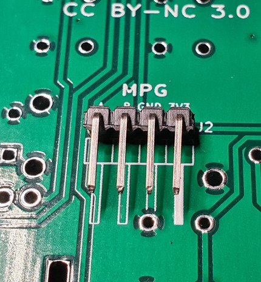

10.  **Soft Estop**: These headers are for a soft estop - the switch must be normally closed (NC) as the estop is actived when the switch is open.
I highly recommend putting the headers on the top for ease of assembly. <br/> 
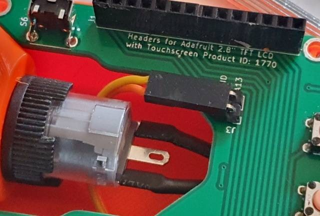
  <br/>
If you are using a a hard wired (or no) estop, you can either bridge these headers or change ```useSoftEstop``` to ```false``` in ```ManualmaticConfig.h``` to free up J3 (GND & pin 27/A13) as spare connection.  <br/>
**NOTE:** Please see main documentation to check if you need to implement the LinuxCNC estop_latch. 

### The Finished PCB

For reference here are the top & bottom views of the PCB (with the Teensy 4.1 plugged in):
<br/> 
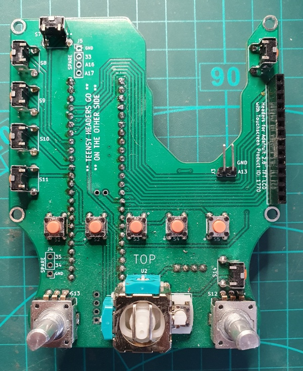

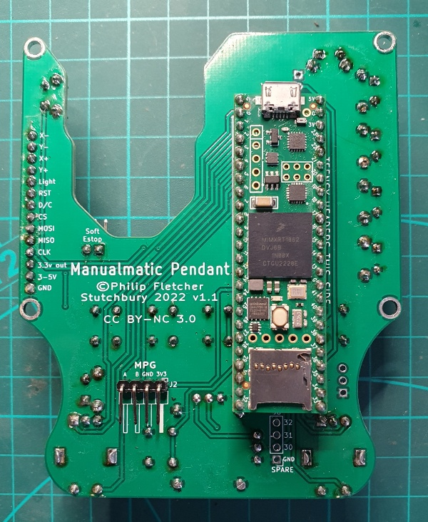


### Optional Connections

There are three 'spare' sets of pin headers on the board that will all work with right angle headers. I would not solder these in unless you intend to use them.
1. **J5**: Provides GND, pins 33, A16 & A17. Headers intended to go on the top of the board and GND+33 are provisionally for a 3mm LED 'torch' built into the case.
2. **J4**: Provides GND, pins 34 (RX8) & 35 (TX8). Headers intended to be on top of the board.
3. **J6**: Provides GND, 30, 31 & 32. Headers intended to be on bottom of the board.

The 3V3 & GND in the middle of the Teensy headers is intended for a Teensy 4.0 (untested and the 5 physical 'row buttons' will not be connected) but can otherwise be used as a 3V3 supply.

