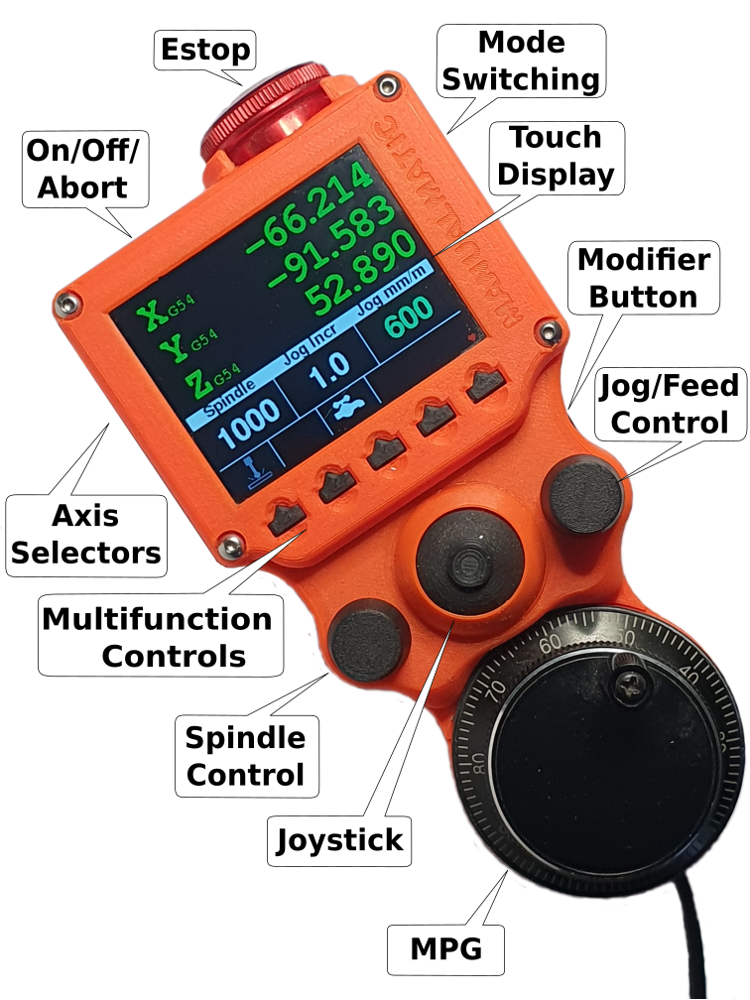
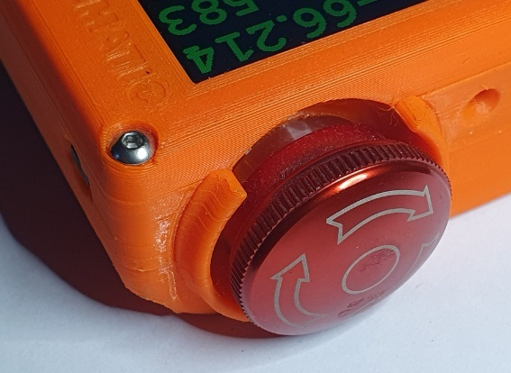
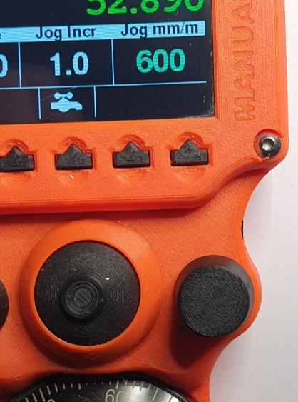

# Manualmatic User Guide <!-- omit from toc -->

- [Operations](#operations)
  - [Controls Overview](#controls-overview)
  - [Display Overview](#display-overview)
  - [Machine On/Off, Abort Operation and Estop](#machine-onoff-abort-operation-and-estop)
    - [Turning On](#turning-on)
    - [Turning Off](#turning-off)
    - [Abort Operation](#abort-operation)
    - [Soft Estop](#soft-estop)
  - [Operating Modes (Manual, MDI, Auto)](#operating-modes-manual-mdi-auto)
    - [Changing Modes](#changing-modes)
  - [Manual Mode](#manual-mode)
    - [Controlling Jog/Feed Speeds \& Increment](#controlling-jogfeed-speeds--increment)
      - [Changing the Jog/Feed Speed](#changing-the-jogfeed-speed)
      - [Changing Jog Increments](#changing-jog-increments)
      - [Switching between Tortoise \& Rabbit Range](#switching-between-tortoise--rabbit-range)
      - [Resetting Jog Speeds to Defaults](#resetting-jog-speeds-to-defaults)
    - [Moving the Axis (Jogging)](#moving-the-axis-jogging)
      - [Using the MPG](#using-the-mpg)
      - [Using the Joystick](#using-the-joystick)
      - [Power Feed](#power-feed)
    - [Controlling the Spindle](#controlling-the-spindle)
      - [Changing the Spindle Speed](#changing-the-spindle-speed)
      - [Starting the Spindle](#starting-the-spindle)
      - [Stopping the Spindle](#stopping-the-spindle)
      - [Resetting Spindle Speed to Default](#resetting-spindle-speed-to-default)
    - [Setting Offsets](#setting-offsets)
    - [Controlling Coolant/Lubrication](#controlling-coolantlubrication)
      - [Toggle Mist](#toggle-mist)
      - [Toggle Flood](#toggle-flood)
  - [Auto Mode](#auto-mode)
    - [Controlling Program Operations](#controlling-program-operations)
      - [Start a Loaded Program (Cycle Start)](#start-a-loaded-program-cycle-start)
      - [Step Through a Loaded Program (Single Block)](#step-through-a-loaded-program-single-block)
      - [Pause \& Resume a Running Program](#pause--resume-a-running-program)
      - [Stop a Running Program](#stop-a-running-program)
    - [Controlling Feed \& Rapid Overrides](#controlling-feed--rapid-overrides)
      - [Override Feed Percent](#override-feed-percent)
      - [Override Rapid Percent](#override-rapid-percent)
      - [Reset to Programmed Feed/Rapid Speeds](#reset-to-programmed-feedrapid-speeds)
    - [Controlling Spindle Overrides](#controlling-spindle-overrides)
      - [Override Spindle Percent](#override-spindle-percent)
      - [Reset Spindle Override](#reset-spindle-override)
    - [Controlling Coolant/Lubrication](#controlling-coolantlubrication-1)
  - [MDI Mode](#mdi-mode)
    - [Controlling Feed, Rapid and Spindle Overrides](#controlling-feed-rapid-and-spindle-overrides)
    - [Controlling Coolant/Lubrication](#controlling-coolantlubrication-2)
- [Installation](#installation)
  - [PlatformIO Install](#platformio-install)
  - [LinuxCNC Install](#linuxcnc-install)
- [Ini File Parameters](#ini-file-parameters)
  - [Standard Ini Parameters](#standard-ini-parameters)
    - [Section `[DISPLAY]`](#section-display)
    - [Section `[SPINDLE_0]`](#section-spindle_0)
    - [Section `[TRAJ]`](#section-traj)
  - [Manualmatic Ini Parameters](#manualmatic-ini-parameters)
    - [Section `[MANUALMATIC]`](#section-manualmatic)

# Operations

## Controls Overview

## Display Overview

[Image: Annotated Screen]

## Machine On/Off, Abort Operation and Estop 

The button on the top left of the Manualmatic is used to turn the machine on, off or abort a currently running operation. 

**Note:** This is the LinuxCNC definition of 'Machine On'.

### Turning On

If the machine is currently 'Off', a single press will turn the machine on.

### Turning Off 

If the machine is currently 'On' a long press will turn the machine off.
When the machine is 'off' the Manualmatic will display an on/off button:

Note: The machine cannot be started via button on the screen to prevent unintentional operation. 

### Abort Operation

In Manual mode, a short press will issue an 'abort' to the currently running operation. This can be useful if your machine is slow to catch up with an overly enthusiastic jog command.

In Auto mode, a short press will effectively issue a stop command to the currently running program.

### Soft Estop

On the top right of the Manualmatic is the Soft Estop button. Press this to trigger LinuxCNC's Estop. Twist to release the estop.

**Please note:** this is a *soft* estop – ie runs through the Manualmatic via USB to the LinuxCNC userspace. It complements but must not be used as a substitute for the hard wired estop that you really (*really*) should also have present on your machine.

When the machine is estopped, the Manualmatic will display the halted icon:

## Operating Modes (Manual, MDI, Auto)

Just like the standard LinuxCNC GUIs, the Manualmatic operates in one of three modes: 

- Manual - use the Manualmatic to operate the mill almost as if it were a manual milling machine, prepare stock, set offsets in preparation for running CAM programs and control mist & flood.
- Auto - control the stop, start, pause and step of a loaded CAM program, view and override feed, rapid and spindle speeds of a running program and control mist & flood. 
- MDI - the Machine Data Interface for running short, manually entered G code.  The Manualmatic is currently for display purposes only in MDI mode.

### Changing Modes

The button on the right side of the Manualmatic will cycle through the normal modes for a CNC machine: Manual, Auto and MDI.

## Manual Mode

### Controlling Jog/Feed Speeds & Increment

Note: In this section 'jog' and 'feed' are used to describe the same thing: moving the axis of the machine. 'Jog' is a term usually used for setting up and 'feed' for when actually cutting stock.

In LinuxCNC, manual jog speed and increments are *per input device*. All other information displayed on the Manualmatic will be syncronised with your main GUI but jog speed and increments used on the Manualmatic will not be reflected on the GUI and vice versa. 

#### Changing the Jog/Feed Speed

Turn the jog/feed control to increase or decrease the jog speed. The control has acceleration enabled, so if you spin the control faster, the jog rate will increment in bigger steps.

#### Changing Jog Increments

To change the Jog Increment, press and turn the jog/feed control.

#### Switching between Tortoise & Rabbit Range

Just like most of the LinuxCNC GUIs, there are two jog ranges, often called 'Tortoise' (for low jog/feed speed) and 'Rabbit' (the default, for fast speed).

A single press on the jog/feed control will toggle between the high and low ranges. 

#### Resetting Jog Speeds to Defaults

To reset to the default jog ranges, long press the jog/feed control. 
This will reset both Rabbit (100%) and Tortoise (10%) ranges. 

### Moving the Axis (Jogging)

#### Using the MPG

The MPG (Manual Pulse Generator) is the traditional way to move an axis. Each 'click' of the control will move the selected axis by the selected jog increment.

Select the required axis using the axis selector buttons on the left side of the Manualmatic, then turn the MPG to move the axis the required distance.
The selected axis will be indicated with a white arrow:

#### Using the Joystick

The joystick can be used to rapidly move two axis. The speed and direction is controlled by the movement of the joystick, up to the displayed jog/feed rate. Note: the joystick is analog, so the jog increment does not apply.

By default, when one axis is moving, the other axis is 'locked' until the joystick is returned to centre. This is to improve the safety of power feed operations but if you want to move diagonally (or in circles) this can be overridden by holding down the modifier button when moving the joystick.

[Image: Circle trace]

#### Power Feed

The Joystick can be used in combination with the MPG for efficiently preparing stock. An axis can have both joystick and MPG enable or your can (for example) have the joystick enabled for X/Y and the MPG enabled for Z. This is very effective for facing operations.

### Controlling the Spindle

#### Changing the Spindle Speed

Turn the spindle control to increase or decrease the spindle speed.

The spindle speed can be changed before starting the spindle or while the spindle is running and will be incremented by one of the values set in the ini file as follows (in order of priority):

1. `[MANUALMATIC] SPINDLE_INCREMENT` You can also set this value to a set RPM (eg 100) or a percent (eg either 0.02 or 2%) for logarithmic-like behaviour. The percentage will be applied to the current spindle speed unless that value is less than 1 RPM.

2. `[DISPLAY] SPINDLE_INCREMENT` Also used by your GUI. 

3. `[SPINDLE_0] INCREMENT` I believe this is [incorrectly documented](https://github.com/LinuxCNC/linuxcnc/issues/3171#issuecomment-2453517563) as the `[SPINDLE_0]` section is intended to contain values for motion controller, not the display but is included here for completeness. 

The spindle control has acceleration enabled, so if you spin the control faster, the spindle speed will increment in larger steps.

The maximum spindle speed that can be set by the Manualmatic will be the lowest value of the following ini entries:

- `[SPINDLE_0] MAX_FORWARD_VELOCITY`
- `[SPINDLE_0] MAX_VELOCITY`
- `[DISPLAY] MAX_SPINDLE_0_SPEED`
- `[DISPLAY] MAX_SPINDLE_SPEED`

**Caution:** It may be possible to overspeed the spindle with the main GUI spindle override control (this is true even when the Manualmatic is not used).

The default spindle speed is set by the `[DISPLAY] DEFAULT_SPINDLE_SPEED` in your ini file.

#### Starting the Spindle

To start the spindle, single press the spindle control and the choose 'Confirm' or 'Cancel'.
[Image: Display spindle confirm & cancel]

#### Stopping the Spindle

To stop the spindle, single press the spindle control and choose 'Confirm' or 'Cancel'.
[Image: Display spindle confirm & cancel]

#### Resetting Spindle Speed to Default

In Manual mode, a long press on the spindle control will reset the spindle override to 100% and if the spindle is not running, will reset the spindle speed to the default defined as `[DISPLAY] DEFAULT_SPINDLE_SPEED` in your `.ini` file.

### Setting Offsets

[Image: Offset Button]

When an axis is selected, the offset button will be enabled. Press the button or tap the screen to show the offset input keypad.

[Image: Display Offset keypad]

### Controlling Coolant/Lubrication

#### Toggle Mist

To toggle mist on or off, single press the Mist/Flood Button or touch the screen icon.

#### Toggle Flood

To toggle flood on or off, double press the Mist/Flood Button. The touch screen icon is not available for this function as there is not yet any 'double touch' function.

Note: It is possible to have both mist and flood operating at the same time.

## Auto Mode
In Auto mode the Manualmatic display will show real time axis coordinates, real time feed, rapid & spindle speeds and override percenatges.

### Controlling Program Operations

The Manualmatic can control the running of a loaded CAM program. When a program is loaded, the buttons turn from grey (inactive) to green. 

#### Start a Loaded Program (Cycle Start)
To start a loaded program, press the 'Start' (Play) or the 'Step' button. 
To prevent accidental starting when pressing the Play button, you will be asked to confirm or cancel the requested action.
**Caution:** Currently the 'Step' button does not ask for confirmation, but this may change in the future (for first press only).
[Image: Cycle Start confirm/cancel buttons] 

#### Step Through a Loaded Program (Single Block)
To step through a new or paused CAM program, press the 'Step' icon. 
**Caution:** the Step will be started immediately without a confirmation prompt.
Please be sure you understand LinuxCNC's concept of a 'step' - it may not behave as you expect it. [This](https://forum.linuxcnc.org/38-general-linuxcnc-questions/43980-stepping-a-program-bug-or-feature?start=0) is a good thread on the subject. 
While a step is running, you can pause the program and then choose to continue stepping or fully resume.

#### Pause & Resume a Running Program
[Image: Cycle Resume/Step buttons]
[Image: Cycle Resume confirm/cancel buttons]
To pause a running program, press the 'Pause' button. The program will be paused immediatelly (ie without a confirm/cancel prompt).

To Resume a paused program, press the 'Resume' or 'Step' button. Consistent with starting a program 'Resume' will ask for confirmation but 'Step' will resume immediately.

**Note:** Pause does not stop the spindle, only the axis.

#### Stop a Running Program
To stop a running program, press the 'Stop' button (or the 'Abort' button on the top of the Manualmatic). 
The program will stop immediately, without a confirmation prompt.
[Image: Stop Program button]

### Controlling Feed & Rapid Overrides
[Image: Feed Override dial]
[Image: Display feed & rapid override]
#### Override Feed Percent

Turn the jog/feed control to increase or decrease the feed override percent. The control has acceleration enabled, so if you spin the control faster, the percentage will increment in bigger steps.

#### Override Rapid Percent

Press and turn the jog/feed control to increase or decrease the rapid override percent. Although control has acceleration enabled, it is not so easy to achieve when pressing the control!

#### Reset to Programmed Feed/Rapid Speeds
Press and hold the jog/feed control to reset both feed & rapid override to 100 percent.

### Controlling Spindle Overrides
[Image: Spindle override dial]
[Image: Display spindle override]

#### Override Spindle Percent
Turn the spindle control to increase or decrease the spindle override percent. The control has acceleration enabled, so if you spin the control faster, the percentage will increment in bigger steps.

#### Reset Spindle Override
Press and hold the jog/feed control to reset spindle override to 100 percent.

### Controlling Coolant/Lubrication
As per [Manual](#manual-mode) mode, both [Mist](#toggle-mist) and [Flood](#toggle-flood) coolant can be controlled via the Manualmatic.

## MDI Mode
### Controlling Feed, Rapid and Spindle Overrides
As per [Auto](#auto-mode) mode, [Feed](#adjust-feed-percent), [Rapid](#adjust-rapid-percent) and [Spindle](#adjust-spindle-percent) speed overrides can be controlled by the Manualmatic.

The spindle can also be started and stopped.

### Controlling Coolant/Lubrication
As per both [Manual](#manual-mode) and [Auto](#auto-mode) modes, both [Mist](#toggle-mist) and [Flood](#toggle-flood) coolant can be controlled via the Manualmatic.

# Installation

Clone or download [this repository](https://github.com/Stutchbury/Manualmatic-Pendant) and extract somewhere convenient (not usually on your LinuxCNC machine).

## PlatformIO Install

Use PlatformIO to install the firmware for the Manualmatic on to the Teensy 4.1.

- Follow the install instructions here: https://platformio.org/platformio-ide

- There are two folders of interest: 
  - The main codebase for the pendant: `Software/PlatformIO/pendant/ManualmaticPendant` or
  - A wiring check 'sketch': `Software/PlatformIO/pendant/ManualmaticWiringCheck` This only really required for PCB development or to check your soldering!p

- Required libraries will be automatically downloaded based on the `platformio.ini` file.

Open either of these folders and PlatformIO will allow you to compile and upload.

## LinuxCNC Install

- Copy both `Manualmatic.py` (the class def) and `manualmatic` (the component, lowercase, no file extension) to your LinuxCNC config directory.
- Add the following line to custom.hal (replace `gmoccapy.ini` with your ini file name):    
`loadusr -W ./manualmatic gmoccapy.ini`
- Change the `manualmatic` file to executable. e.g. `chmod +x manualmatic` 
- Plug your manualmatic pendant into a USB port - make sure appears as `/dev/ttyACM0`
- Start LinuxCNC, preferably from the command line (to see any errors).

Note: LinuxCNC >= v2.9 now uses python3 with no default to 'python', so the `manualmatic` component file and the `mock_cnc_machine.py` file have been updated to use python3.

# Ini File Parameters

Ini file parameters are used to set default values and preferences on the Manualmatic.

## Standard Ini Parameters

These are the 'standard' options from your `.ini` file that are read by the Manualmatic Python component. Some may or may not exist as different config tools and/or GUIs create different parameters.

### Section `[DISPLAY]`

- `MAX_FEED_OVERRIDE`

- `MIN_SPINDLE_OVERRIDE`

- `MIN_SPINDLE_0_OVERRIDE`

- `MAX_SPINDLE_OVERRIDE`

- `MAX_SPINDLE_0_OVERRIDE`

- `DEFAULT_SPINDLE_SPEED`

- `DEFAULT_SPINDLE_0_SPEED`

- `MAX_SPINDLE_SPEED`

- `MAX_SPINDLE_0_SPEED`

- `DEFAULT_LINEAR_VELOCITY` For jogging.

- `MAX_LINEAR_VELOCITY`

### Section `[SPINDLE_0]`

- `MAX_FORWRD_VELOCITY`
- `MAX_VELOCITY`
- `INCREMENT`

### Section `[TRAJ]`

- `LINEAR_UNITS`

- `ANGULAR_UNITS`
  Not currently used.

- `DEFAULT_LINEAR_VELOCITY`

- `MAX_LINEAR_VELOCITY`

- `NO_FORCE_HOMING`
  Default: 0
  Do not force homing before jogging is allowed.

## Manualmatic Ini Parameters

### Section `[MANUALMATIC]`

- `SPINDLE_INCREMENT`

